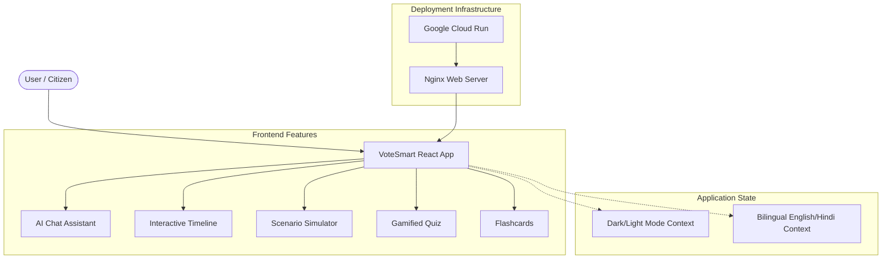
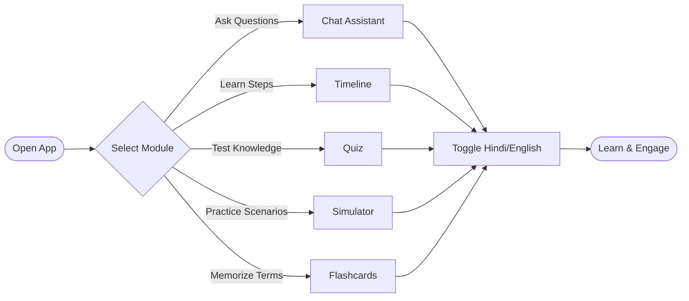

# 🗳️ VoteSmart: Interactive Election Platform

Elections are the pillar of democracy, but understanding the election process can sometimes feel overwhelming. 

**VoteSmart** is an interactive, bilingual (English & Hindi) educational platform designed to simplify the Indian Election process. It transforms civic education from reading a dry rulebook into an engaging, interactive conversation and experience. 

---

## 🚀 Live Demo
Access the live application hosted on Google Cloud Run: 
**[VoteSmart Live Demo](https://votesmart-898928325653.us-central1.run.app)**

---

## ✨ Features

### 💬 AI Chat Assistant
A simulated AI chatbot designed to answer civic queries. Users can ask questions about how to register to vote, what an EVM is, or the steps of the election process, and receive instant, personalized answers. *(Currently running simulated logic, structured for seamless integration with Google Gemini AI).*

### 📅 Interactive Timeline
A dynamic, step-by-step visual guide outlining the complete Indian Election process:
1. Delimitation of Constituencies
2. Voter Registration
3. Notification of Elections
4. Filing Nominations
5. Campaigning
6. Voting Day (EVM)
7. Counting & Results

### 🛡️ Scenario Simulator
A "choose-your-own-adventure" style game where users can navigate real-world election-day challenges (e.g., "Your name is missing from the voter roll," or "You arrived at the wrong polling station") to learn practical problem-solving.

### 🏆 Gamified Quizzes
A real-time scoring system to test your knowledge about the Election Commission of India, VVPATs, and voting rights. Earn interactive badges like 🌱 Novice Voter, 🏅 Informed Citizen, or 🏆 Civic Master.

### 🎴 Flashcards
Interactive, 3D-flipping flashcards for mastering key election terminology like **ECI**, **NOTA**, and the **Model Code of Conduct (MCC)**.

### 🌓 Built-In Accessibility
- **Dark/Light Mode**: Smooth transitions managed via CSS variables.
- **Bilingual Support**: Real-time toggling between English and Hindi across the entire app.

---

## 🏗️ Architecture & Diagrams

### Application Architecture


### User Workflow


---
## 🛠️ Tech Stack

- **Frontend**: React 19, TypeScript, Vite
- **Styling**: Pure CSS (Modularized & Responsive)
- **Icons**: Lucide React
- **Deployment**: Docker, Nginx, Google Cloud Run

---

## 💻 Local Development

Follow these steps to run VoteSmart locally on your machine:

1. **Clone the repository:**
   ```bash
   git clone https://github.com/srijabhattacharyya23-dot/VoteSmart.git
   cd VoteSmart
   ```

2. **Install dependencies:**
   ```bash
   npm install
   ```

3. **Run the development server:**
   ```bash
   npm run dev
   ```

4. **Build for production:**
   ```bash
   npm run build
   ```

---

*Designed to make citizens more informed, confident, and engaged.*
